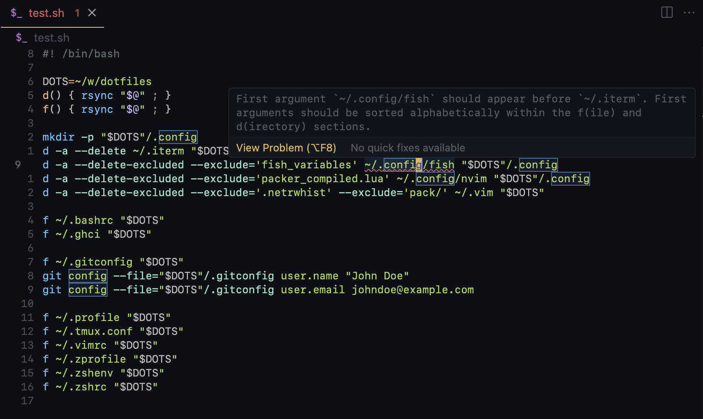

# alphabetical-backup-lsp

A linter for your backup shell scripts that implements the [Language Server Protocol](https://microsoft.github.io/language-server-protocol/). Currently integrated in a VSCode extension. Only supports linting bash scripts.

`d`irectories first. `f`iles later. The first argument (file/directory to be copied over) in alphebatical order within the `f` and `d` sections.

The `d` and `f` commands should be aliased to whatever copy command you'd like to use, e.g. `rsync`.



It may not be the most _practical_ linter with the most idiomatic code, but it's been a fun, narrow scope project to introduce myself to Rust and explore Tree-sitter, LSPs, and VSCode extension development.

## Lint rules

- The first argument to `f` and `d` commands must be sorted in alphabetical order within their respective sections.
- The first `f` command must appear after the last `d` command.
- The first argument must be a string literal.
- The first argument must exist.

## Demo

https://github.com/mattkhan/alphabetical-backup-lsp/assets/86168986/c3b51366-a4fb-4504-9271-ed33cb334ee7

Sample bash script in [docs/samples/](docs/samples).

## Development

Run the extension locally:

```bash
npm i
cargo run
npm run compile
```

Open the VSCode debugger and use a project with a sample `.sh` file.

UX inspired by Rubocop's [OrderedGems](https://docs.rubocop.org/rubocop/cops_bundler.html#bundlerorderedgems) lint rule.
